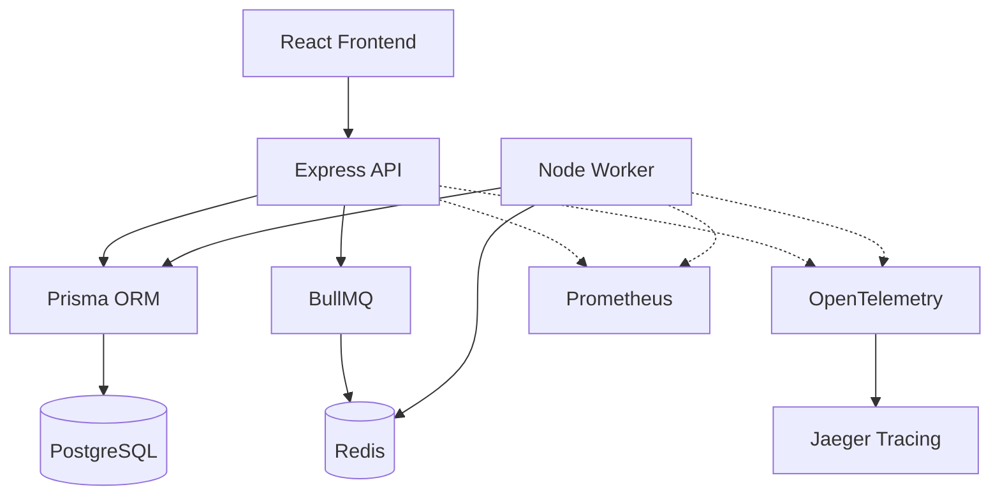

# Architecture Overview

## System Components

- **Frontend:** React + TypeScript (Vite)
- **Backend:** Express + Node.js
- **Database:** PostgreSQL accessed via Prisma ORM
- **Queues:** BullMQ + Redis for asynchronous background tasks
- **Observability:** Prometheus + OpenTelemetry + Jaeger
- **Deployment:** Docker + Kubernetes

## Architecture Diagram

## Key Flows

1. **Synchronous Requests:** Standard REST operations hit Express, get rate-limited, query PostgreSQL, and return immediately.
2. **Asynchronous Requests:** Heavy operations (e.g. bulk payroll) are pushed into BullMQ via Redis. Workers pull jobs and stream progress via WebSockets.
3. **Observability:** Every request and worker job is wrapped in OpenTelemetry spans and logged deterministically via Pino.
